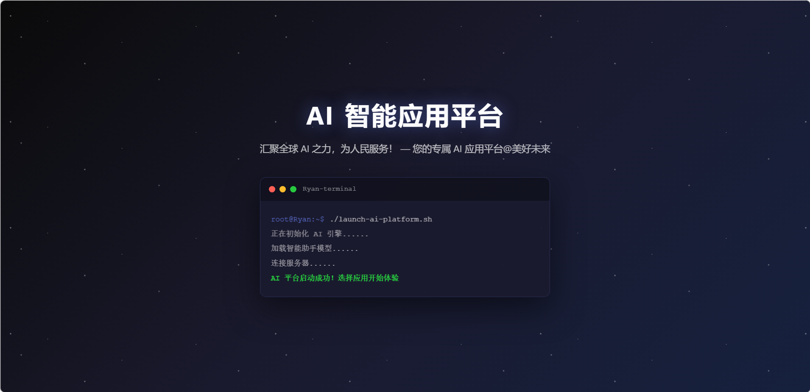
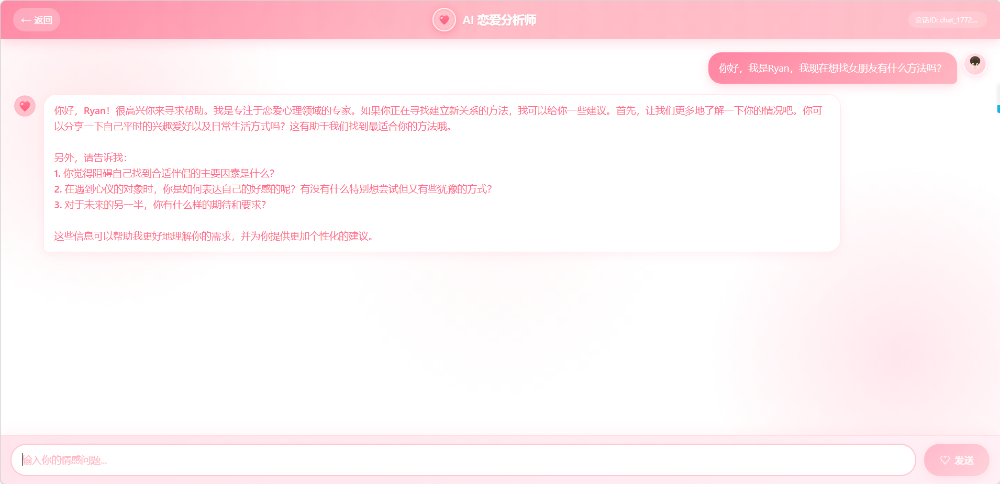
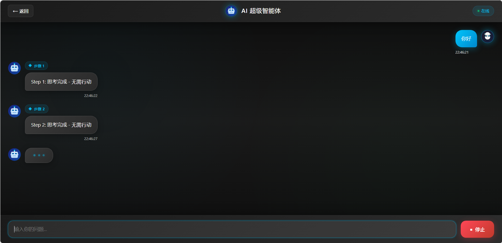

# ZY AI Agent

## 1. 项目简介 🚀

ZY AI Agent 是一个基于 Spring Boot 和 Vue 3 开发的 AI 智能体应用，集成了多种 AI 能力，包括对话、搜索、文档处理等，旨在为用户提供智能化的交互体验。

- 采用 **模型适配器模式**，可插拔接入多种大模型（当前支持 Qwen、GLM、ChatGPT、阿里云百炼）
- 引入向量数据库作为 RAG 知识库，分为'恋爱知识库'与'通用知识库'两部分
- 后端基于 Spring Boot + Spring AI 构建，前端基于 Vue 3 + Vite 开发

## 2. 项目特性 ✨

- 🤖 **多智能体支持**：内置恋爱分析师、AI 助手等多种智能体
- 🔍 **强大的搜索能力**：集成图像搜索和 Web 搜索功能
- 📚 **RAG 增强**：基于向量数据库的知识库问答系统
- 🌐 **前后端分离**：Spring Boot 后端 + Vue 3 前端
- 📱 **现代化 UI**：响应式设计，支持多设备访问
- 🚀 **快速部署**：支持 Docker 容器化部署
- 🧩 **多模型支持**：可插拔接入 Qwen、GLM、ChatGPT 等多种大模型

## 3. 为什么有用 💡

- **智能化交互**：提供自然语言交互接口，降低使用门槛
- **多场景应用**：可用于恋爱咨询、日常助手、文档处理等多种场景
- **可扩展架构**：支持自定义智能体和工具扩展
- **企业级可靠性**：基于 Spring Boot 构建，稳定可靠
- **开源免费**：完全开源，可自由定制和二次开发
- **多模型适配**：灵活切换不同 AI 模型，适应不同场景需求

## 4. 项目预览 📸

- 
  ### 前端启动页



- ### 前端首页


- ### AI 恋爱分析师页面




- ### AI 超级智能体页面



## 5. 快速开始 🚀

### 环境要求

- **Java 21** 或更高版本
- **Node.js 20** 或更高版本
- **Maven 3.9** 或更高版本
- **PostgreSQL** 数据库（可选，用于向量存储）

### 安装步骤

1. **克隆项目**

```bash
git clone https://github.com/yourusername/zy-ai-agent.git
cd zy-ai-agent
```

2. **配置环境变量**

创建 `.env` 文件，添加以下配置：

```
AI_DASHSCOPE_API_KEY=your-dashscope-api-key
SEARCH_API_KEY=your-search-api-key
```

3. **启动后端服务**

```bash
# 编译并启动后端
./mvnw spring-boot:run
```

后端服务将在 `http://localhost:8123/api` 启动。

4. **启动前端服务**

```bash
# 进入前端目录
cd Ryan-ai-agent-frontend
# 安装依赖
npm install
# 启动前端开发服务器
npm run dev
```

前端服务将在 `http://localhost:5173` 启动。

### 使用 Docker 部署

```bash
# 构建镜像
docker build -t zy-ai-agent:latest .

# 运行容器
docker run -d \
  --name zy-ai-agent \
  -p 8123:8123 \
  -e AI_DASHSCOPE_API_KEY=your-api-key \
  -e SEARCH_API_KEY=your-search-key \
  zy-ai-agent:latest
```

## 6. 使用示例 📖

### 6.1 访问前端应用

打开浏览器，访问 `http://localhost:5173`，您将看到应用启动页。

### 6.2 选择智能体

在首页选择您需要的 AI 应用，例如：
- **AI 恋爱分析师**：提供恋爱咨询服务
- **AI 智能体**：提供日常助手服务

### 6.3 开始对话

在聊天界面输入您的问题，智能体将为您提供回答。例如：

```
用户：我最近和女朋友吵架了，该怎么办？
恋爱分析师：你好，我是专注于恋爱心理领域的专家。听到你最近遇到了和女朋友之间的矛盾，感到非常理解......
```

### 6.4 使用高级功能

- **文件处理**：上传文件进行分析和处理
- **搜索功能**：使用内置搜索获取最新信息
- **文档生成**：生成各种格式的文档

## 7. 项目结构 📁

```
zy-ai-agent/
├── Ryan-ai-agent-frontend/      # Vue 3 前端应用
├── Ryan-image-search-mcp-server/ # 图像搜索服务
├── src/                          # Spring Boot 后端源码
│   ├── main/java/               # Java 源代码
│   └── main/resources/          # 配置文件和资源
├── Dockerfile                   # Docker 构建文件
├── pom.xml                      # Maven 依赖配置
└── README.md                    # 项目文档
```

## 8. 技术栈 🛠️

### 8.1 后端
- Spring Boot 3.4.4 + Spring AI + Java 21 + 向量数据库

### 8.2 前端
- Vue 3 + Vue Router + Vite + Axios

### 8.3 AI 模型支持
- **Qwen**：通义千问系列模型
- **GLM**：智谱清言系列模型
- **ChatGPT**：OpenAI 系列模型
- **阿里云百炼**：阿里云大模型服务
- **其他**：支持扩展接入更多模型

## 9. 开发环境搭建 💻

### 9.1 后端开发

1. **安装 JDK 21**
2. **安装 Maven**
3. **安装 IDE**（推荐 IntelliJ IDEA）

### 9.2 前端开发

1. **安装 Node.js 20**
2. **安装 VS Code**（推荐）
3. **安装 Vue 插件**

## 10. 贡献指南 🤝

我们欢迎社区贡献！如果您想参与项目开发，请按照以下步骤：

1. **Fork 项目**
2. **创建特性分支**：`git checkout -b feature/AmazingFeature`
3. **提交更改**：`git commit -m 'Add some AmazingFeature'`
4. **推送到分支**：`git push origin feature/AmazingFeature`
5. **创建 Pull Request**

### 10.1 提交规范

- **提交信息格式**：`type(scope): description`
- **Type**：feat, fix, docs, style, refactor, test, chore
- **Scope**：功能模块名称
- **Description**：简短描述更改内容

## 11. 测试与部署 🧪

### 11.1 运行测试

```bash
# 运行后端测试
./mvnw test

# 运行前端测试
cd Ryan-ai-agent-frontend
npm run test
```

### 11.2 构建生产版本

```bash
# 构建后端
./mvnw clean package -DskipTests

# 构建前端
cd Ryan-ai-agent-frontend
npm run build
```

## 12. 常见问题 ❓

### Q: 如何添加新的智能体？
A: 在 `src/main/java/com/ryan/zyaiagent/agent` 目录下创建新的智能体类，实现相应接口。

### Q: 如何扩展知识库？
A: 在 `src/main/resources/document` 目录下添加 markdown 文档，系统会自动加载。

### Q: 如何配置不同的 AI 模型？
A: 在 `application.yml` 文件中修改 `spring.ai.dashscope.chat.options.model` 配置，支持 Qwen、GLM、ChatGPT 等多种模型。

### Q: 如何新增支持的 AI 模型？
A: 采用模型适配器模式，新增模型只需实现适配器并注册，支持无缝扩展各种 AI 模型。

## 13. 项目状态 📊

- **开发状态**：活跃开发中
- **最新版本**：0.0.1-SNAPSHOT
- **许可证**：MIT

## 14. 路线图 🗺️

- [x] 基础对话功能
- [x] 恋爱分析师智能体
- [x] 图像搜索功能
- [x] Web 搜索功能
- [x] 多模型支持
- [ ] 更多智能体支持
- [ ] 多语言支持
- [ ] 移动端适配

## 15. 许可证 📄

本项目采用 MIT 许可证，详见 [LICENSE](LICENSE) 文件。

## 16. 联系方式 📞

- **项目地址**：https://github.com/Sun-Ryan1/zy-ai-agent
- **作者**：Sun-Ryan1
- **邮箱**：1819165504@qq.com


## 17. 致谢 🙏

感谢所有为项目做出贡献的开发者和用户！

---

**如果您觉得这个项目有用，请给个 ⭐️ 支持一下！**
